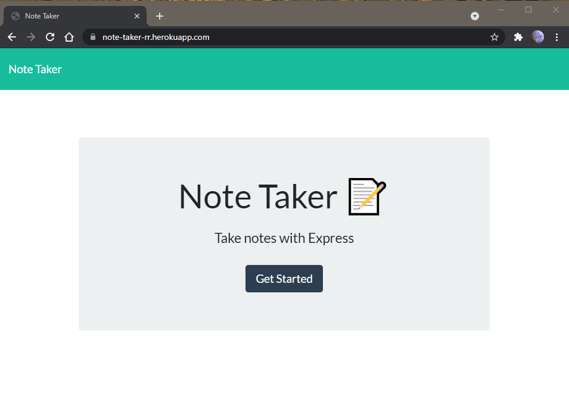

# #11: Note Taker

## [App Deloyed on Heroku](https://note-taker-rr.herokuapp.com/)

## Description: App to write, title, save, recall, and delete notes using text area and title bar.

# Installation:

    Open heroku link and click "Get Started"
