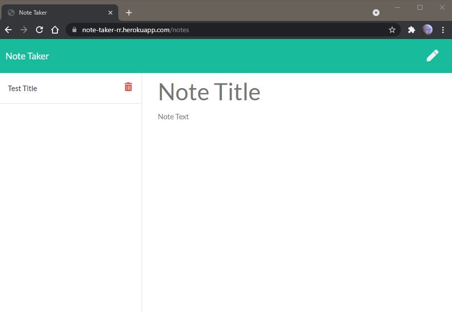
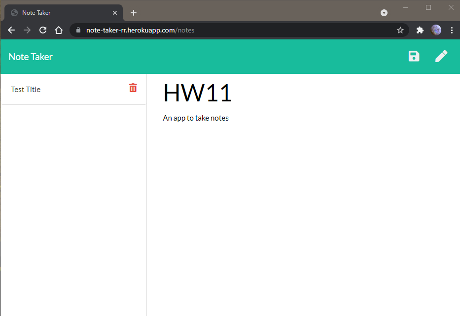
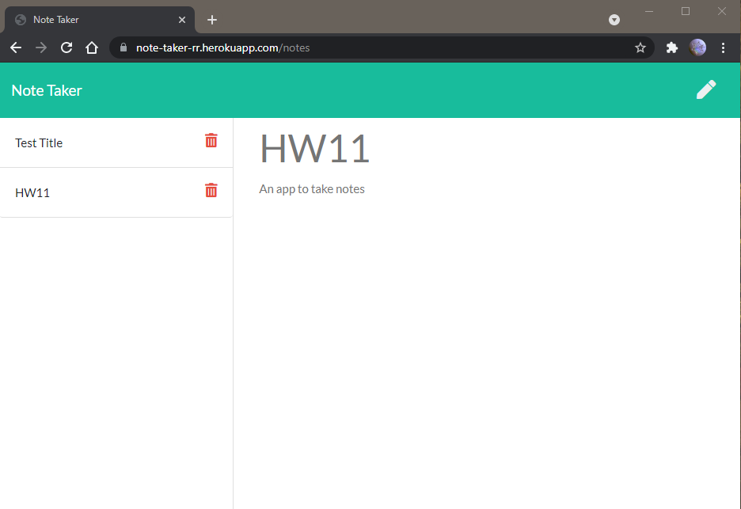

# #11: Note Taker

## [App Deloyed on Heroku](https://note-taker-rr.herokuapp.com/)

## Description: App to write, title, save, recall, and delete notes using text area and title bar.

# Installation:

    Open heroku link and click "Get Started"

# Usage:

    Use "Note Title" and "Note Text" text area to write a note

    Hit the save button to store in list; select from list to recall.

# Questions: https://github.com/Crowderyan

### Email me: <a href="mailto:Rebuiltrival@gmail.com" hspace="20">Rebuiltrival@gmail.com</a>
